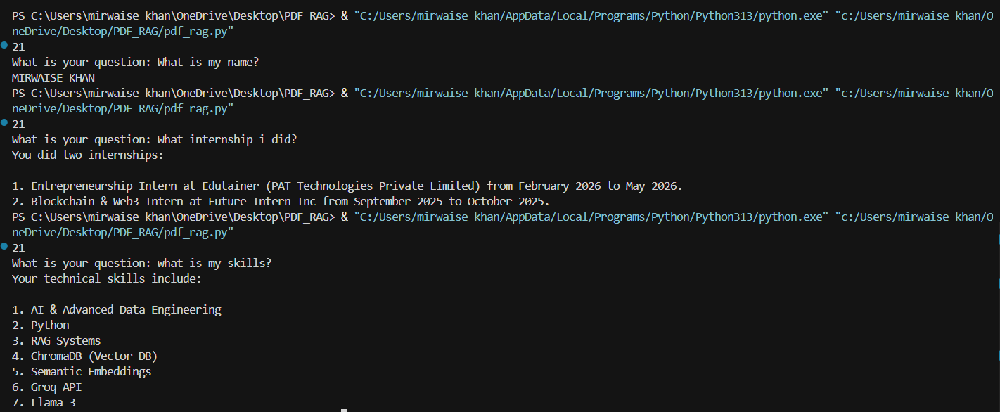

# 📄 PDF RAG System

A Retrieval-Augmented Generation (RAG) application built using Python, ChromaDB, Groq, and PyPDF that can answer questions directly from PDF documents.

---

## 🚀 Features

* Extract text from PDF files
* Clean and preprocess document content
* Split documents into searchable chunks
* Store chunks in ChromaDB
* Retrieve relevant information using semantic search
* Generate answers using Groq + Llama 3

---

## 🛠️ Tech Stack

* Python
* PyPDF
* ChromaDB
* Groq API
* Llama 3

---

## 📂 Project Workflow

```text
PDF
↓
Extract Text
↓
Clean Text
↓
Chunk Text
↓
Store in ChromaDB
↓
Retrieve Relevant Chunks
↓
Create Context
↓
Groq LLM
↓
Answer
```

---

## 💡 Example Questions

* What is my name?
* What internships have I completed?
* What are my technical skills?
* What projects have I worked on?
* Summarize my profile.

---
## 📸 Demo



## 📸 Sample Output

Question:
What internships have I completed?

Answer:

* Entrepreneurship Intern (Edutainer)
* Blockchain & Web3 Intern (Future Intern Inc.)

---

## 🎯 What I Learned

* PDF text extraction
* Document chunking
* Vector databases
* Semantic retrieval
* Retrieval-Augmented Generation (RAG)
* Groq API integration

---

## 🔮 Future Improvements

* Better chunking strategy
* Streamlit web interface
* Multi-PDF support
* Contract AI Extractor integration

---

## 👨‍💻 Author

Mirwaise Khan

Aspiring AI Product Engineer focused on Python, RAG systems, and AI-powered applications.
